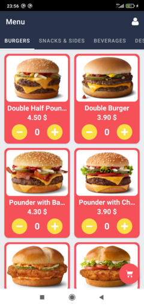
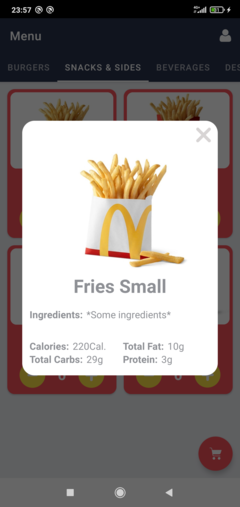
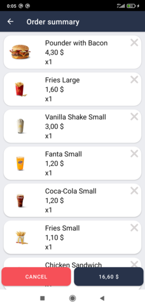
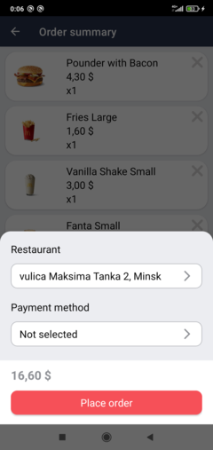
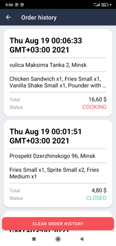

# Fast Food App

With this app you can order food from a chain of restaurants. It lets you pay with cash or with your card and track the status of your order.

# Features

- User authentication
- Adding menu items into a shopping cart
- Checkout flow
- Orders history

# Screenshots

# Development Environment

The app is written in Java and uses the Gradle build system. Server-side code is JavaScript.

To build the app, use the gradlew build command or use "Import Project" in Android Studio.

# Technologies/Architecture used

- [Model-View-ViewModel][1] (MVVM) architecture
- [Room persistence library][2] for storing menu items info
- [Firebase Authentication][3]
- [Firebase Firestore][4] for storing user data
- [Firebase Cloud Functions][5]
- [Stripe][6] integration for processing payments with card and storing user payment methods

[1]: https://en.wikipedia.org/wiki/Model%E2%80%93view%E2%80%93viewmodel
[2]: https://developer.android.com/training/data-storage/room
[3]: https://firebase.google.com/products/auth?gclid=CjwKCAjwgviIBhBkEiwA10D2j1yRx2LdW65HF1tAMvE_1PVgpA5qKI044NmZH72idttG-WyCr8KOTxoCGPUQAvD_BwE&gclsrc=aw.ds
[4]: https://firebase.google.com/products/firestore?gclid=CjwKCAjwgviIBhBkEiwA10D2j6anLjARJY3s8qp_jUqHjdyO096aM9O8X796PAro-sEOCpNf2d0jbxoC3mUQAvD_BwE&gclsrc=aw.ds
[5]: https://firebase.google.com/products/functions?gclid=CjwKCAjwgviIBhBkEiwA10D2j0d_1KYwoiJbnGfGwNAztFIxT3K93WTBtofpdLDl2KKybbX3vq7hORoCv18QAvD_BwE&gclsrc=aw.ds
[6]: https://stripe.com/docs